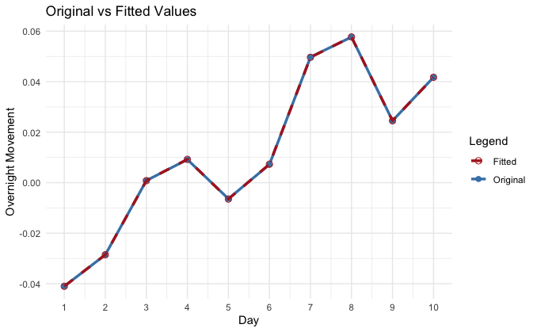

---
editor_options:
  markdown:
    wrap: 72
output: pdf_document
---

# The Market That Never Sleeps: Probabilistic Analysis of Stock and Bond Overnight Movements via Linear Algebra

**By Sam Lu and Sebastian Reyes**

# 1. Introduction

This project analyzes stock and bond behavior via data from the SPDR S&P
500 ETF Trust (SPY) and the iShares 20+ Year Treasury Bond ETF (TLT),
respectively. We utilized data ranging from December 2004 to April 2025.

At its core, our project researched overnight movements in the stock
market, in which a given stock's price when the market opens is higher
or lower than its previous closing price. We chose to investigate the
relationship between overnight movement in the SPY index and the TLT
index.

There were two main questions this project hoped to investigate.
Firstly, we aimed to learn whether Markov chains may be used to model
long-term stock market behavior. Secondly, we aimed to learn whether
fitting a polynomial via least-squares approximation could provide
insights on the overnight price movements of SPY over a set interval of
time.

**CBT, NEED TO CITE WHERE WE GOT THE DATA FROM**

# 2. Markov Chains

## 2A. Background

A ***Markov chain*** is defined as an evolving system comprising of a
sequence of ***stages*** where each stage is in one of a finite number
of ***states***, and where the state of a given stage is only dependent
on the state of the stage immediately before it. To phrase it
differently, the Markov property--one of the defining features of a
Markov chain--states that $P(X_{t+1} = s_j \mid X_t = s_i)$, or that the
probability of a given state $X$ at time $t+1$ is only dependent on the
given state X at time $t$. This probability is known as a ***transition
probability***.

***Stochastic matrices***, also commonly known as ***probability
matrices***, are mathematical tools which may be used to represent
Markov chains. They are square matrices of dimension $n$, where $n$ is
the number of possible states in the system. Each column represents a
current state $j$, and each row represents a subsequent state $i$. The
entries of a stochastic matrix $P_{ij}$ are the transition probabilities
corresponding to each state combination. An example stochastic matrix is
displayed in **Figure A**, in which the entry $P_{12}$ indicates that
given a current state of 2, there is a probability of 0.4 (or 40%) that
the next state will be 1. This gives rise to a key property of
stochastic matrices: $\sum_{i} P_{ij} = 1 \; \text{for all } j$. In
other words, the sum of each column must be equal to 1, as there must be
a 100% chance that stage $t+1$ is in one of the $n$ possible finite
states, regardless of the state at stage $t$.

**Figure A:** $$
P = 
\begin{bmatrix}
0.7 & 0.4 \\
0.3 & 0.6 \\
\end{bmatrix}
$$

Any column of a probability matrix may also be isolated to form a
***state vector*** $\vec{s}$ of dimension $n$. The probabilities of each
state at a stage $m$ can be found by raising each component of the
vector to the power of $m$. $$
\vec{s}^{(m)} = 
\begin{bmatrix}
s_1^{m} \\
\vdots \\
s_n^{m}
\end{bmatrix}
$$ This new vector is known as the ***m***$^{th}$ state vector.
Accordingly, raising $\vec{s}$ to the power of 0 will result in the
***initial state vector***. State vectors may also be used to
investigate the long-term behavior of a system. This can be done by
finding the vector $\vec{s}^{(m)}$ as $m$ approaches infinity. $$
\lim_{m \to \infty} \vec{s}^{(m)} = \vec{s}
$$ This results in what is known as a ***steady-state vector***. This
steady-state vector may be found via the formula shown below, where $I$
is an identity matrix of the same dimensions as the probability matrix
$P$, and where $\vec{s}$ is the steady state vector. This formula is
equivalent to solving a homogeneous system.

$$
(I-P) \vec{s} = 0
$$

## 2B. Application Methods

We utilized Python to create a dataframe (an object used to store
tabular data) which displayed the share price of SPY and the share price
of TLT at the time the markets opened and at the time the markets closed
each day. **Figure 1** contains an example of this.

**Figure 1:** $$
\begin{array}{c|cccc}
\text{Date} & \text{SPY Open} & \text{SPY Close} & \text{TLT Open} & \text{TLT Close} \\
\hline
2025\text{-}04\text{-}01 & 557.45 & 560.97 & 107.83 & 108.20 \\
2025\text{-}04\text{-}02 & 555.05 & 564.52 & 108.01 & 109.00 \\
2025\text{-}04\text{-}03 & 545.11 & 537.70 & 109.25 & 108.73 \\
\end{array}
$$

We then used this data to calculate the share price fluctuation that
took place the previous night. This was calculated as
$(Open_t - Close_{t-1})/Close_{t-1}$. For example, the SPY overnight
movement corresponding to April 2nd, 2025 according to **Figure 1**
would be $(555.05-560.97)/560.97$, resulting in a movement of
approximately $-0.011$, or $-1.1\%$. We then normalized these movements
using Z-scores. In this manner, 4 possible states were established,
depending on overnight behavior for that date. These states are
explained in **Figure 2**.

**Figure 2:** $$
\begin{array}{|c|c|c|c|}
\hline
\textbf{State} & \textbf{Stock Movement (Z)} & \textbf{Bond Movement (Z)} & \textbf{Interpretation} \\
\hline
1 & \geq 0 & \geq 0 & \text{Stock up, Bond up} \\
\hline
2 & \geq 0 & < 0 & \text{Stock up, Bond down} \\
\hline
3 & < 0 & \geq 0 & \text{Stock down, Bond up} \\
\hline
4 & < 0 & < 0 & \text{Stock down, Bond down} \\
\hline
\end{array}
$$

Following the establishment of these 4 states, we once again utilized
Python to create a table displaying how many times the different states
"fed into" one another. This table is displayed in **Figure 3**, where
each column represents the current state, and each row represents the
subsequent state. For instance, entry (1, 2) of **Figure 3** indicates
that there were 305 instances where a day categorized as State 2 was
immediately followed by a day categorized as State 1 (i.e. Monday =
State 2, Tuesday = State 1).

**Figure 3:** $$
\begin{array}{c|cccc}
 & \text{State 1} & \text{State 2} & \text{State 3} & \text{State 4} \\
\hline
\text{State 1} & 219 & 305 & 318 & 207 \\
\text{State 2} & 292 & 482 & 560 & 279 \\
\text{State 3} & 317 & 539 & 419 & 250 \\
\text{State 4} & 221 & 287 & 227 & 195 \\
\end{array}
$$

Following the use of **Figure 3**, we opted to scale each column such
that each individual entry would be a proportion. That is, to scale
entry (1, 1), we took the sum of column 1 (219, 292, 317, and 221),
indicating that there were a total of 1049 days in our data which were
categorized as being in State 1. Dividing entry (1, 1) by 1049, we found
that a proportion of 0.2088, or 20.88% of days categorized as State 1
were immediately followed by *another* day categorized as State 1. In
this manner, we reduced the entire table, as displayed in **Figure 4**.

**Figure 4:** $$
\begin{array}{c|cccc}
 & \text{State 1} & \text{State 2} & \text{State 3} & \text{State 4} \\
\hline
\text{State 1} & 0.2088 & 0.1891 & 0.2087 & 0.2223 \\
\text{State 2} & 0.2784 & 0.2988 & 0.3675 & 0.2997 \\
\text{State 3} & 0.3022 & 0.3342 & 0.2749 & 0.2685 \\
\text{State 4} & 0.2107 & 0.1779 & 0.1490 & 0.2095 \\
\end{array}
$$

Slightly changing this table to take the form of a matrix, we found
ourselves with **Figure 5**. This was our final ***probability
matrix***, or ***stochastic matrix***.

**Figure 5:** $$
P = 
\begin{bmatrix}  
0.2088 & 0.1891 & 0.2087 & 0.2223 \\  
0.2784 & 0.2988 & 0.3675 & 0.2997 \\  
0.3022 & 0.3342 & 0.2749 & 0.2685 \\  
0.2107 & 0.1779 & 0.1490 & 0.2095  
\end{bmatrix}  
$$

We then utilized this stochastic matrix, in combination with Python, to
find the ***steady-state vector*** for the system. The formula used for
this calculation is displayed in **Figure 6**, and the resulting
steady-state vector is as shown in **Figure 7.**

**Figure 6:**

$$
(I-P)\vec{s} = 0
$$

**Figure 7:**

$$
\vec{s} = \begin{bmatrix}0.2050 \\0.3152 \\0.2980 \\0.1817\end{bmatrix}
$$

## 2C. Application Results

The steady-state vector found provided three primary insights.

1.  $P(1+2) > P(3+4)$. That is, it is more likely that overnight stock
    movement will be positive rather than negative. This is intuitive,
    as stocks tend to rise.
2.  $P(1+3) \approx P(2+4)$. Once more, this is to be expected, as
    20-year bonds are usually constant/steady.
3.  $P(2+3) > P(1+4)$. This is logical due to stocks and bonds
    historically being negatively correlated. As such, it is natural
    that divergence is more likely than convergence.

# 3. Least-Squares Approximation

## 3A. Background

***Least-Squares Approximation***, per our class, is defined as a method
to fit a line through a set of data points by minimizing the sum of the
squared distances between the fitted line and each data point. In linear
algebra terms, least-squares approximation is seeking to find a line on
$\mathbb{R}^2$, $\begin{bmatrix} a \\ b \end{bmatrix}$ , that best fits
a series of points $(x_1, y_1)...(x_n, y_n)$. The values $a$ and $b$ are
the slope and intercept of the line, respectively, and the line of "best
fit" is defined as the line that minimizes
$s = (ax_1 + b - y_1)^2 ... + (ax_n + b - y_n)^2$, where $ax_n+b$ is the
value predicted by the line, and $y_n$ is the value of the data point.
In terms more closely aligned with linear algebra, $s$ may also be
defined by the quantity below.

$$
s =
\left\| 
\begin{bmatrix}
ax_1 + b \\
\vdots \\
ax_n + b
\end{bmatrix}
-
\begin{bmatrix}
y_1 \\
\vdots \\
y_n
\end{bmatrix}
\right\|^2
$$

This implies that the below value is to be minimized.

$$
\left\|
\begin{bmatrix}
x_1 & 1 \\
\vdots & \vdots \\
x_n & 1
\end{bmatrix}
\begin{bmatrix}
a \\
b
\end{bmatrix}
-
\begin{bmatrix}
y_1 \\
\vdots \\
y_n
\end{bmatrix}
\right\|^2
$$

Defining
$A = \begin{bmatrix} x_1 & 1 \\ \vdots & \vdots \\ x_n & 1 \end{bmatrix}$,
$\vec{v} = \begin{bmatrix} a \\ b \end{bmatrix}$, and
$\vec{b} = \begin{bmatrix} y_1 \\ \vdots \\ y_n \end{bmatrix}$, this
leaves us with the goal of minimizing the quantity
$\left\| A\vec{v} - \vec{b} \right\|^2$. Knowing this, the establishment
of three main facts must be established prior to continuing:

1.  If $\vec{v}$ minimizes $\left\| A\vec{v} - \vec{b} \right\|^2$,
    $\vec{b}-A\vec{v}$ is normal to every vector in $im(A)$. This
    implies that$(A \vec{w}) \cdot (\vec{b} - A \vec{v}) = 0$, for any
    $\vec{w}$ in the image space of $A$.
2.  Given two vectors in the image space of A, $\vec{w_1}$ and
    $\vec{w_2}$, $\vec{w_1}\cdot\vec{w_2}=\vec{w_1}^T\;\vec{w_2}$. This
    implies that
    $(A \vec{w})^T(\vec{b}-A \vec{v}) = 0 \implies \vec{w}^T A^T(\vec{b}-A \vec{v}) = 0$.
3.  Given any vector $\vec{w}$ in the image space of $A$ such that
    $\vec{w} \cdot \vec{w'} = 0$ for **all** $\vec{w'}$, it is implied
    that$\vec{w'} = \vec{w} = 0 \implies \vec{w} \cdot (A^T(\vec{b} - A \vec{v}) = 0 \implies (A^TA)\vec{v} = A^T \vec{b}$.
    **CBT, CHECK MATH THEORY HERE**

Thus, the ***normal equation*** to be used is defined as
$(A^TA) \vec{v} = A^T \vec{b}$. This equation can be utilized to the
find the vector $\vec{v} = \begin{bmatrix} a \\ b \end{bmatrix}$.

## 3B. Application Methods

We utilized Python to extracted the overnight movement data for the
first 30 days of our SPY dataset, starting at December 2nd, 2004. We
then smoothed this data through the use of moving averages. That is, we
created a new string of data, $x$, such that a given entry $x_i$ would
be equal to the average of data points $i$ through $i+20$. In this
manner, entry $x_1$ would be equivalent to the average overnight
movement of SPY between the 1st and 21st days included in our dataset.
In other words, $x_i = \sum\limits_{i}^{i+20}{(SPY \; Data)_i}$. The
resulting 10 data points are displayed in **Figure 8**. Note that in
this case, $x$ was more of an index regarding a given time period's
average (i.e. $x=1 \implies$ $y =$ average of first 20 overnight price
movement data points), as opposed to a value with in-context meaning.

**CBT, NOMENCLATURE REGARDING MOVING AVERAGES AND THEIR RELATIONSHIP W/
LABELING INDIVIDUAL DAYS**

**Figure 8:**

$$
\begin{array}{|c|c|c|}
\hline
\textbf{x} & \textbf{Date Period} & \textbf{Average Overnight Movement (y)} \\
\hline
1 & 2004\text{-}12\text{-}22 \text{ to } 2005\text{-}01\text{-}11 & -0.041002 \\
2 & 2004\text{-}12\text{-}23 \text{ to } 2005\text{-}01\text{-}12 & -0.028533 \\
3 & 2004\text{-}12\text{-}24 \text{ to } 2005\text{-}01\text{-}13 & \phantom{-}0.000847 \\
4 & 2004\text{-}12\text{-}25 \text{ to } 2005\text{-}01\text{-}14 & \phantom{-}0.009175 \\
5 & 2004\text{-}12\text{-}26 \text{ to } 2005\text{-}01\text{-}15 & -0.006357 \\
6 & 2004\text{-}12\text{-}27 \text{ to } 2005\text{-}01\text{-}16 & \phantom{-}0.007206 \\
7 & 2004\text{-}12\text{-}28 \text{ to } 2005\text{-}01\text{-}17 & \phantom{-}0.049741 \\
8 & 2004\text{-}12\text{-}29 \text{ to } 2005\text{-}01\text{-}18 & \phantom{-}0.057683 \\
9 & 2004\text{-}12\text{-}30 \text{ to } 2005\text{-}01\text{-}19 & \phantom{-}0.024539 \\
10 & 2004\text{-}12\text{-}31 \text{ to } 2005\text{-}01\text{-}20 & \phantom{-}0.041740 \\
\hline
\end{array}
$$

Following this, we opted to fit a 9-degree polynomial rather than a line
$\vec{v} = \begin{bmatrix} a \\ b \end{bmatrix} = \begin{bmatrix} slope \\ intercept \end{bmatrix}$
. This would result in the polynomial being represented by the vector in
**Figure 8**, where each entry $c_i$ is the coefficient of the term in
the polynomial $x^i$. In other words, the polynomial represented by
**Figure 9** would follow the form of
$y = c_0 + c_1x + c_2x^2 ... c_9x^9$.

**Figure 9**:

$$
\vec{v} =
\begin{bmatrix}
c_0 \\
c_1 \\
c_2 \\
\vdots \\
c_9
\end{bmatrix}
$$

Following this, we created a Vandermonde matrix $M$, whose general form
is displayed in **Figure 10**.

**Figure 10:**

$$
M =
\begin{bmatrix}
1 & x_1 & x_1^2 & x_1^3 & \cdots & x_1^d \\
1 & x_2 & x_2^2 & x_2^3 & \cdots & x_2^d \\
\vdots & \vdots & \vdots & \vdots & \ddots & \vdots \\
1 & x_n & x_n^2 & x_n^3 & \cdots & x_n^d \\
\end{bmatrix}
$$

For calculation purposes, this matrix $M$ worked very similarly to the
matrix
$A = \begin{bmatrix} x_1 & 1 \\ \vdots & \vdots \\ x_n & 1 \end{bmatrix}$
that would be generated when fitting a line. Each row of the Vandermonde
matrix still corresponded to one point, with each column corresponding
to a power of $x$. Applying this model to our data point using Python,
we received the output displayed in **Figure 11**.

**Figure 11:**

$$
M =\begin{bmatrix}
1 & 1 & 1 & 1 & 1 & 1 & 1 & 1 & 1 \\
1 & 2 & 4 & 8 & 16 & 32 & 64 & 128 & 256 \\
1 & 3 & 9 & 27 & 81 & 243 & 729 & 2187 & 6561 \\
1 & 4 & 16 & 64 & 256 & 1024 & 4096 & 16384 & 65536 \\
1 & 5 & 25 & 125 & 625 & 3125 & 15625 & 78125 & 390625 \\
1 & 6 & 36 & 216 & 1296 & 7776 & 46656 & 279936 & 1679616 \\
1 & 7 & 49 & 343 & 2401 & 16807 & 117649 & 823543 & 5764801 \\
1 & 8 & 64 & 512 & 4096 & 32768 & 262144 & 2097152 & 16777216 \\
1 & 9 & 81 & 729 & 6561 & 59049 & 531441 & 4782969 & 43046721 \\
1 & 10 & 100 & 1000 & 10000 & 100000 & 1000000 & 10000000 & 100000000 \\
\end{bmatrix}
$$

We then utilized Python to calculate $M^T$, as displayed in **Figure
12**.

**Figure 12:**

$$
M^T =
\begin{bmatrix}
1 & 1 & 1 & 1 & 1 & 1 & 1 & 1 & 1 & 1 \\
1 & 2 & 3 & 4 & 5 & 6 & 7 & 8 & 9 & 10 \\
1 & 4 & 9 & 16 & 25 & 36 & 49 & 64 & 81 & 100 \\
1 & 8 & 27 & 64 & 125 & 216 & 343 & 512 & 729 & 1000 \\
1 & 16 & 81 & 256 & 625 & 1296 & 2401 & 4096 & 6561 & 10000 \\
1 & 32 & 243 & 1024 & 3125 & 7776 & 16807 & 32768 & 59049 & 100000 \\
1 & 64 & 729 & 4096 & 15625 & 46656 & 117649 & 262144 & 531441 & 1000000 \\
1 & 128 & 2187 & 16384 & 78125 & 279936 & 823543 & 2097152 & 4782969 & 10000000 \\
1 & 256 & 6561 & 65536 & 390625 & 1679616 & 5764801 & 16777216 & 43046721 & 100000000 \\
\end{bmatrix}
$$

Following this, we then used Python once again to calculate $M^TM$, as
displayed in **Figure 13.**

**Figure 13:**

$$
M^T M =
\begin{bmatrix}
1.0 \times 10^1 & 5.5 \times 10^1 & 3.9 \times 10^2 & 3.0 \times 10^3 & 2.5 \times 10^4 & 2.2 \times 10^5 & 2.0 \times 10^6 & 1.8 \times 10^7 & 1.7 \times 10^8 \\
5.5 \times 10^1 & 3.9 \times 10^2 & 3.0 \times 10^3 & 2.5 \times 10^4 & 2.2 \times 10^5 & 2.0 \times 10^6 & 1.8 \times 10^7 & 1.7 \times 10^8 & 1.6 \times 10^9 \\
3.9 \times 10^2 & 3.0 \times 10^3 & 2.5 \times 10^4 & 2.2 \times 10^5 & 2.0 \times 10^6 & 1.8 \times 10^7 & 1.7 \times 10^8 & 1.6 \times 10^9 & 1.5 \times 10^{10} \\
3.0 \times 10^3 & 2.5 \times 10^4 & 2.2 \times 10^5 & 2.0 \times 10^6 & 1.8 \times 10^7 & 1.7 \times 10^8 & 1.6 \times 10^9 & 1.5 \times 10^{10} & 1.4 \times 10^{11} \\
2.5 \times 10^4 & 2.2 \times 10^5 & 2.0 \times 10^6 & 1.8 \times 10^7 & 1.7 \times 10^8 & 1.6 \times 10^9 & 1.5 \times 10^{10} & 1.4 \times 10^{11} & 1.4 \times 10^{12} \\
2.2 \times 10^5 & 2.0 \times 10^6 & 1.8 \times 10^7 & 1.7 \times 10^8 & 1.6 \times 10^9 & 1.5 \times 10^{10} & 1.4 \times 10^{11} & 1.4 \times 10^{12} & 1.3 \times 10^{13} \\
2.0 \times 10^6 & 1.8 \times 10^7 & 1.7 \times 10^8 & 1.6 \times 10^9 & 1.5 \times 10^{10} & 1.4 \times 10^{11} & 1.4 \times 10^{12} & 1.3 \times 10^{13} & 1.3 \times 10^{14} \\
1.8 \times 10^7 & 1.7 \times 10^8 & 1.6 \times 10^9 & 1.5 \times 10^{10} & 1.4 \times 10^{11} & 1.4 \times 10^{12} & 1.3 \times 10^{13} & 1.3 \times 10^{14} & 1.2 \times 10^{15} \\
1.7 \times 10^8 & 1.6 \times 10^9 & 1.5 \times 10^{10} & 1.4 \times 10^{11} & 1.4 \times 10^{12} & 1.3 \times 10^{13} & 1.3 \times 10^{14} & 1.2 \times 10^{15} & 1.2 \times 10^{16} \\
\end{bmatrix}
$$

We found the inverse of matrix $M^TM$, as shown in **Figure 14**.

We substituted $M$ and $M^T$ in the equation $(A^TA)\vec{v}=A^T \vec{b}$
to obtain the formula $(M^TM)\vec{v}=M^T \vec{b}$. Utilizing the
recently calculated matrix $(M^TM)^{-1}$, we were then able to solve for
$\vec{b}$ using the
formula$(M^TM)^{-1}(M^TM)\vec{v}=(M^TM)^{-1}M^T\vec{b}$, or
$\vec{v} = (M^TM)^{-1}M^T\vec{b}$ . The resulting vector $\vec{v}$ is
displayed in **Figure 14.**

**Figure 14:**

$$
\vec{v} =
\begin{bmatrix}
-5.7953 \times 10^{-1} \\
\phantom{-}1.4424 \times 10^{0} \\
-1.5139 \times 10^{0} \\
\phantom{-}8.1931 \times 10^{-1} \\
-2.4904 \times 10^{-1} \\
\phantom{-}4.4040 \times 10^{-2} \\
-4.4831 \times 10^{-3} \\
\phantom{-}2.4316 \times 10^{-4} \\
-5.4368 \times 10^{-6} \\
\end{bmatrix}
$$

Plugging these coefficients into our previously established polynomial
of form $y = c_0 + c_1x + c_2x^2 ... c_9x^9$, we were left with the
equation below.

**Figure 15:**

$$
f(x) =
-0.5795
+ 1.4424x
- 1.5139x^2
+ 0.8193x^3
- 0.2490x^4
+ 0.0440x^5 \\[6pt]
- 0.0045x^6
+ 0.0002432x^7
- 0.000005437x^8
$$

Finally, using Python one more time, we were able to use this polynomial
to approximate the values of each value of $x$, as displayed in **Figure
16** and plotted in **Figure 17**.

**CBT, UNSURE ABOUT WHETHER APPROPRIATE TO LABEL DAYS AS 1-10, OR KEEP X
AS INDEX VALUES**

**Figure 16:**

$$
\begin{array}{|c|c|c|}
\hline
\textbf{x} & \textbf{Original} & \textbf{Fitted} \\
\hline
1 & -0.041002 & -0.040999 \\
2 & -0.028534 & -0.028522 \\
3 & \phantom{-}0.000848 & \phantom{-}0.000815 \\
4 & \phantom{-}0.009175 & \phantom{-}0.009258 \\
5 & -0.006356 & -0.006479 \\
6 & \phantom{-}0.007206 & \phantom{-}0.007330 \\
7 & \phantom{-}0.049740 & \phantom{-}0.049659 \\
8 & \phantom{-}0.057683 & \phantom{-}0.057718 \\
9 & \phantom{-}0.024539 & \phantom{-}0.024531 \\
10 & \phantom{-}0.041740 & \phantom{-}0.041742 \\
\hline
\end{array}
$$

**Figure 17:**

